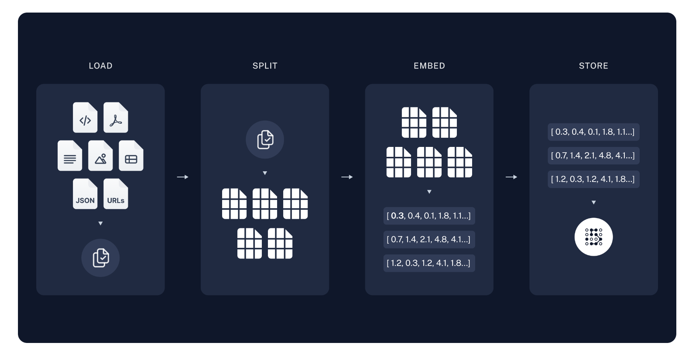
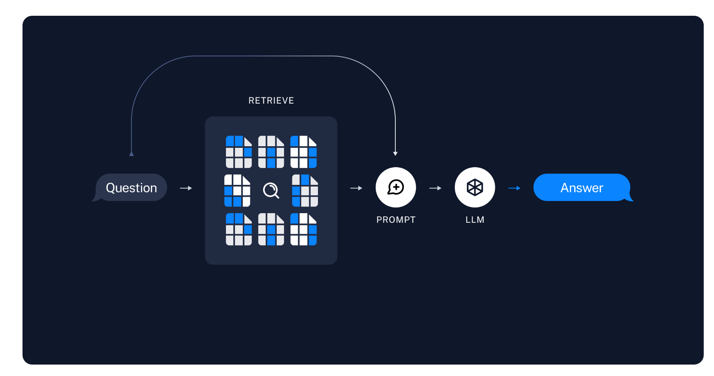

# RAG(검색 증강 생성) 이란?

RAG는 ‘Retrieval-Augmented Generation’의 약자로, 한글로는 ‘검색 증강 생성’
이 기술은 기존의 생성형 AI 모델에 실시간 정보 검색 능력을 결합한 혁신적인 접근방법이다.

RAG의 핵심 아이디어는 사용자의 질문에 답변할 때, 시스템은 먼저 관련된 정보를 검색하고, 이를 LLM에 제공하여 보다 정확하고 최신의 답변을 생성하게 하는 것. 이는 LLM의 고정된 지식만을 사용하는 것보다 훨씬 유연하고 강력한 접근 방식.

이 과정을 통해 RAG는 AI 모델의 기존 지식과 최신 외부 정보를 효과적으로 결합하여, 더욱 정확하고 시의적절한 답변을 제공할 수 있게 된다.

# RAG의 해결책

1. 최신 정보 접근: 실시간으로 외부 데이터베이스를 검색하여 항상 최신 정보를 반영할 수 있다.
2. 전문 지식 강화: 특정 도메인의 전문 데이터베이스를 연결하여 깊이 있는 전문 지식을 제공할 수 있다.
3. 맥락 인식 향상: 사용자의  질문과 관련된 구체적인 정보를 검색하여 더 정확한 맥락 이해가 가능하다.
4. 정보의 신뢰성 향상: 검색된 실제 데이터를 바탕으로 답변을 생성하므로 환각 현상을 크게 줄일 수 있다.

# 1) 색인 작업 (Indexing)

다양한 외부 데이터 소스(ex: 코드 파일, PDF, 텍스트 문서, 이미지, 스프레드시트, JSON, URLs 등) 에서 정보를 추출한다. 이 단계는 데이터 로딩, 테이터 분할, 임베딩 생성, 그리고 저장의 4단계로 이루어짐

- 로드 (Load): 다양한 포맷의 데이터를 로드한다. 이 과정에서 HTML, PDF, 텍스트, 이미지, 표 등의 형식을 지원하며, JSON과 URL도 포함된다.
- 분할 (Split): 로드된 데이터를 관리하기 쉽게 작은 단위로 분할한다. 이를 통해 후속 작업의 효율성을 높인다.
- 임베딩 (Embed): 분할된 데이터를 벡터 형태로 변환한다. 임베딩은 데이터의 의미를 벡터 공간에서 표현하는 방식으로, 유사도 계산 등에 사용된다.
- 저장 (Store): 생성된 임베딩을 데이터베이스나 벡터 스토어에 저장한다. 이를 통해 추후 검색 작업이 가능해진다.

이 과정을 통해 외부 데이터는 검색 가능한 벡터 형태로 변환된다.

# 2) 검색( Retrieval)

사용자가 질문을 입력하면, RAG 시스템은 질문의 의미를 분석하여 가장 관련성 높은 정보를 색인에서 검색한다.

- 질문 분석 (Question Analysis): 사용자의 질문을 벡터 형태로 변환한다.
- 검색 (Retrieve): 변환된 질문 벡터를 기반으로, 저장된 임베딩 중 관련성 높은 임베딩을 검색한다. 이 과정에서 유사도 계산이 사용된다.

검색된 정보는 질문과 가장 관련성이 높은 데이터로, 이 정보가 다음 단계에서 사용된다.

# 3) 생성 (Generation)

검색된 정보를 바탕으로 LLM(대형 언어 모델) 이 최종 답변을 생성한다.

- 프롬포트 작성: 검색된 정보를 이용하여 LLM에 입력할 프롬포트를 구성한다.
- 답변 생성 (LLM Generation): LLM은 입력된 프롬포트를 바탕으로 질문에 대한 최종 답변을 생성한다.

이 과정을 통해 RAG는 LLM의 일반적인 지식과 특정 도메인의 최신 정보를 효과적으로 결합하여 사용자가 필요로 하는 정확한 답변을 제공한다.

# RAG를 활용한 웹서비스 개발

RAG 기술을 실제 웹서비스에 구현하는 과정은 여러 단계로 이루어진다. 먼저, 문서 로드 및 분할을 통해 지식 베이스를 구축한다. 그 다음, 벡터 저장소 생성으로 효율적인 정보 검색을 위한 기반을 마련한다. RAG 체인 생성은 이 모든 요소를 하나로 연결하여 실제 질의응답 시스템을 구축하는 핵심 단계이다.

이렇게 구축된 RAG 시스템은 Streamlit을 사용하여 간단한 웹 인터페이스 구현을 통해 사용자 친화적인 웹서비스로 만들 수 있다.

---