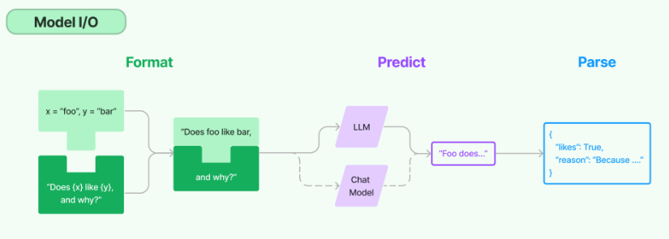
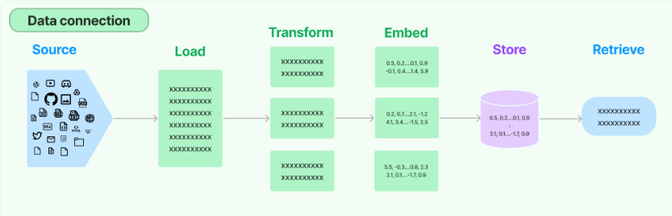
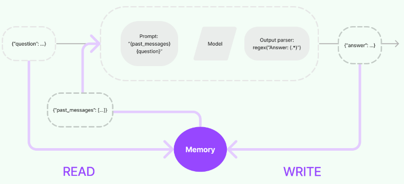

# 랭체인 (LangChain)

**LangChain**은 언어 모델(LLM: Large Language Models)을 기반으로 애플리케이션을 개발하기 위한 프레임워크입니다. 단순히 언어 모델을 API로 호출하는 것에 그치지 않고, 외부 데이터와 상호작용 하거나 다른 시스템과 통합할 수 있는 복잡한 애플리케이션을 구축할 수 있도록 돕기 위해 개발된 오픈소스 프로젝트입니다.

# 1. LangChain의 주요 모듈

LangChain은 여러 모듈을 통해 확장 가능한 표준 인터페이스를 제공하며, 외부 기능을 통합할 수 있도록 설계되어 있습니다. 주요 모듈은 다음과 같습니다:

1.1 Model I/O

언어 모델 인터페이스

모델 I/O 모듈은 언어 모델과의 상호작용을 담당하며, 모든 언어 모델 애플리케이션의 핵심이 되는 요소입니다. 이 모듈은 다양한 언어 모델과의 인터페이스를 쉽게 구성할 수 있도록 도와줍니다.

- Prompt: 모델에 입력할 내용을 일정한 형식(템플릿)으로 만들어주는 기능입니다. 프롬프트를 템플릿으로 만들어 필요한 상황에 맞게 동적으로 선택하거나 관리할 수 있습니다. 이를 통해 모델의 응답을 더 일관되고 효과적으로 조정할 수 있습니다.
- Language models: 다양한 언어 모델(예: GPT, BERT 등)을 공통 인터페이스를 통해 호출할 수 있도록 지원합니다. 이를 통해 특정 모델에 종속되지 않고, 여러 모델을 쉽게 교체하거나 사용할 수 있습니다.
- Output Parser: 모델의 출력을 분석하고, 그 안에서 필요한 정보를 추출하는 기능입니다. 이를 통해 모델의 결과를 더욱 유용하게 사용할 수 있도록 도와줍니다.
    
    
    

1.2 데이터 연결 (Data Connection)

데이터 연결 모듈은 애플리케이션에서 필요한 외부 데이터와 상호작용할 수 있도록 하는 기능입니다. 많은 언어 모델 기반 애플리케이션에서는 훈련된 모델의 데이터뿐만 아니라 사용자별 데이터나 실시간 데이터를 필요로 합니다. 이 모듈은 이러한 데이터와 상호작용할 수 있는 다양한 도구를 제공합니다.

- Document loaders: 다양한 데이터 소스(예: 웹사이트, 데이터베이스, 파일 등)에서 문서를 불러오는 기능입니다.
- Document transformers: 불러온 문서를 필요한 형식으로 변환하거나, 문서를 분할하고 Q&A 형식으로 변환하는 등의 작업을 수행합니다. 중복된 문서를 제거하거나, 특정 패턴을 추출하는 등의 작업도 포함됩니다.
- Text embedding models: 비정형 텍스트(예: 사람의 언어로 된 문장 등)를 숫자 벡터로 변환하는 기능입니다. 이러한 벡터는 기계 학습 모델이 이해하고 처리할 수 있는 형태로, 텍스트 간의 유사도를 계산하거나 검색 기능을 구현하는 데 사용됩니다.
- Vector stores: 변환된 벡터 데이터를 저장하고 검색할 수 있는 기능입니다. 이를 통해 대량의 데이터에서 유사한 항목을 빠르게 찾거나 검색할 수 있습니다.
- Retrievers: 저장된 데이터를 쿼리하고 검색하는 기능입니다. 사용자가 입력한 검색어에 맞는 데이터를 효과적으로 찾아냅니다.
    
    
    

### 1.3 체인 (Chains)

체인은 여러 개의 작업을 연결하여 복잡한 워크플로우를 만드는 모듈입니다. 각각의 작업은 하나의 언어 모델 호출, 데이터 처리 단계, 또는 외부 API 호출일 수 있습니다. 이 체인을 통해 여러 단계를 거쳐 복잡한 작업을 자동화할 수 있습니다.

- **Simple Chains:**
    
    하나의 모델 호출 뒤에 다른 작업을 연결하여 순차적으로 실행하는 간단한 체인입니다. 예를 들어, 질문을 받아 답변을 생성한 후, 생성된 답변을 요약하는 작업을 수행하는 체인입니다.
    
- **Sequential Chains:**
    
    여러 단계를 순차적으로 연결하여 실행할 수 있는 체인입니다. 예를 들어, 문서를 불러오고, 텍스트 임베딩을 생성한 뒤, 벡터 스토어에 저장하는 과정을 체인으로 묶어 자동으로 처리할 수 있습니다.
    
- **Multi-Input Chains:**
    
    여러 입력이 필요한 복잡한 워크플로우를 지원하는 체인입니다. 다양한 데이터를 받아 이를 가공하고, 각각의 결과를 종합하여 최종 결과를 도출합니다.
    

### 1.4 에이전트 (Agents)

에이전트는 사용자 명령에 따라 스스로 작업을 수행하는 모듈입니다. 에이전트는 체인과 다르게, 사전 정의된 일련의 작업이 아니라 상황에 맞게 작업을 동적으로 선택하고 실행할 수 있습니다. 이는 특히 복잡하거나 예측할 수 없는 상황에서 유용합니다.

- **Tool-Using Agents:**
    
    외부 도구(예: API 호출, 데이터베이스 조회 등)를 사용할 수 있는 에이전트입니다. 에이전트는 사용자의 요청에 따라 필요한 도구를 선택하고 이를 실행하여 원하는 결과를 얻을 수 있습니다.
    
- **Self-Learning Agents:**
    
    수행한 작업의 결과를 학습하여 스스로 성능을 향상시키는 에이전트입니다. 이런 에이전트는 반복적으로 작업을 수행하면서 더 나은 결정을 내릴 수 있도록 개선됩니다.
    

### 1.5 메모리 (Memory)

메모리 모듈은 언어 모델이 대화나 작업의 맥락을 기억하고 유지할 수 있도록 합니다. 이는 특히 대화형 애플리케이션에서 유용하며, 사용자의 요청에 맞춰 이전에 수행한 작업이나 대화 내용을 기반으로 다음 작업을 결정할 수 있게 해줍니다.

- **Short-Term Memory:**
    
    짧은 기간 동안의 맥락을 유지하는 메모리입니다. 예를 들어, 사용자가 한 대화에서 언급한 내용을 그 대화가 끝날 때까지 기억하는 기능입니다.
    
- **Long-Term Memory:**
    
    장기적으로 데이터를 저장하고 참조할 수 있는 메모리입니다. 예를 들어, 사용자 프로필 정보나 과거 상호작용 내역을 장기적으로 기억하여 다음 대화에서 사용할 수 있습니다.
    

### 1.6 평가 (Evaluation)

LangChain은 생성된 텍스트의 품질을 평가할 수 있는 도구도 제공합니다. 이 기능은 모델의 출력을 모니터링하고, 이를 분석하여 모델의 성능을 향상시키는 데 도움을 줍니다.

- **Feedback Loops:**
    
    사용자 피드백을 통해 모델의 출력을 평가하고, 이를 반영하여 모델 성능을 개선할 수 있는 기능입니다.
    
- **Automated Evaluation:**
    
    자동화된 기준을 설정하여 모델의 출력을 지속적으로 평가하는 기능입니다. 예를 들어, 생성된 텍스트의 정확성, 일관성, 창의성 등을 자동으로 측정하고 평가할 수 있습니다.
    

### 1.7 보안 및 접근 제어 (Security and Access Control)

LangChain은 안전하고 통제된 환경에서 언어 모델을 사용할 수 있도록 다양한 보안 기능을 제공합니다.

- **Access Control:**
    
    특정 사용자나 애플리케이션에 대한 접근 권한을 설정하고 관리하는 기능입니다. 이를 통해 민감한 데이터나 기능에 대한 접근을 제한할 수 있습니다.
    
- **Data Privacy and Protection:**
    
    데이터의 프라이버시를 보호하고, 데이터 유출이나 무단 접근으로부터 데이터를 안전하게 보호할 수 있는 기능을 제공합니다.